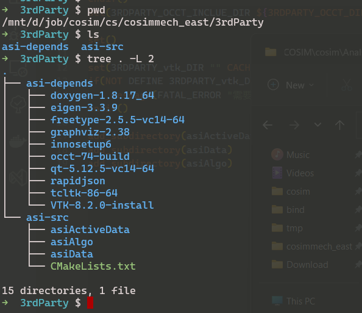

1. 创建一个目录 `xxx`
2. 将公司主机上的`\\COSIM\cosim\AnalsisStius依赖` 下的压缩包解压出来到`xxx/asi-depends` 下
3. 将 analsis situs源码(只有 ActiveData,Algo和 Data 三个模块) 放到 `xxx/asi-src`下, 最终如当前目录


4. 将我发过来的`asi-src`文件夹对 `xxx/asi-src` 进行覆盖(将原本的CMake文件进行替换了)

5.  在 `xxx/asi-src/ `目录下运行命令行，输入:
```sh
cmake -B ../build 
```
6. 在`xxx`下会生成`build`目录,  打开 `xxx/build/*.sln` 文件，分别切换 debug 与 release版本进行编译
7. 生成的动态库与静态库位于 `xxx/bin` 下 包含 bin/bind 与 lib/libd 目录(有d的就是debug版本
8. 在工程中把 `asi-src` 目录加入项目依赖，或者说是 include 的头文件来运用， 然后在 vs 的项目设置中进行链接静态库 , **同时**拷贝`output/bin{d}/*.dll` 到 exe的目录下)

最终的目录结构类似这样:
