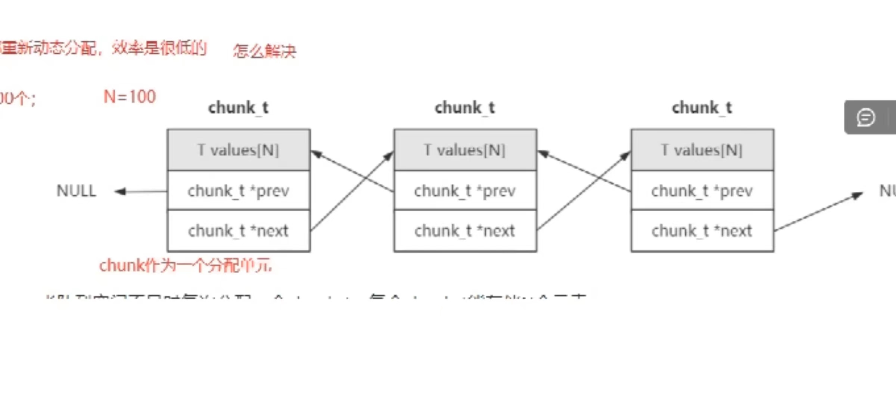

# 设计一个无锁队列
---
## 1. 为什么要用无锁队列
1. cache 失效问题
	- 加锁线程切换到内核态，转换cache可能会丢失
	- 线程来回切换，cache 空间不足时
2. 同步机制上的竞争-
	- 争夺锁，影响性能
3. 链表方式实现时
	- **需要动态分配节点** （分配内存也需要切换到内核态）
	- 链表方式在1对1（Producer & Consumer) 是没有数组快的

## 2. 实现
>在性能足够的情况下，一般不要去做无锁优化，保证数据同步安全

### 方案
1. 多个线程共用一个队列
2. 一个线程使用一个队列(避免争抢)

### 数据结构
1. 链表（动态分配）
2. 数组（固定大小）
3. zmq ypipct （链表加数组的方式）
	1. 用固定大小的数组（chunk） 以链表连接, chunk 作为一个分配单元

	2. 大概分配比例 200-300, n=100, chunk= 3
	3. 使用完一个chunk后怎么处理
		-  把这个chunk，连接到队列末
	
### 没有数据可读取时，怎么办？
1. `usleep(1ms)`, 或者1ms时间太长
2. mutex : notify : condition
	- 什么时候触发notify? 与有锁的condition 有何区别?
	- 每次 push 都 notify？
3. zmq 的无锁队列如何解决唤醒问题