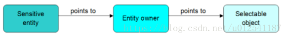
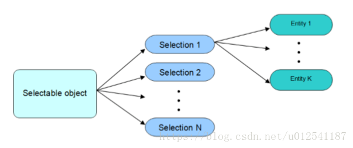

## 主要组件

### AIS、PrsMgr、StdPrs、V3d。
> 自定义显示时还需要组件：Prs3d、Gra phic3d。
- `AIS`—-包含了交互显示对象需要实现的所有类。
- `PrsMgr`—-如果想用自定义的显示对象而不是AIS提供的对象时，需要实现此包中定义的两个抽象类和一个实体类。抽象类：Presentation and PresentableObject 、实体类PresentationManager3d。
- `StdPrs`—-为特殊几何体准备的显示。
- `Prs3d`—-基本的显示算法、属性：影藏、线宽、颜色等。
- `V3d`—-支持3dview的服务。
- `Graphic3d`— 提供创建3D graphic structures所需的资源。
- `Visual3d`—-实现了3D viewer命令的类。


```cpp
Handle(V3d_Viewer) theViewer; 
Handle(AIS_InteractiveContext) aContext = new AIS_InteractiveContext (theViewer);
BRepPrimAPI_MakeWedge aWedgeMaker (theWedgeDX, theWedgeDY, theWedgeDZ, theWedgeLtx); 
TopoDS_Solid aShape = aWedgeMaker.Solid(); 
Handle(AIS_Shape) aShapePrs = new AIS_Shape (aShape); // creation of the presentable object 
aContext->Display (aShapePrs); // display the presentable object in the 3d viewer
```

## 选中
### 1. 选择方式
-   **_static select_** 静态选择，鼠标单击选中。
-   **_dynamic select_** 动态选择，鼠标移动时的选择。
###  2. 三种选择手段
-   **_point_**点选
-   **_rectangle selection_**框选
-   **_polyline selection_** 多边形选择
### 3.选择模式
• 0 – selection of the entire object∗(AIS_Shape)∗; 整体选择
• 1 – selection of the vertices;顶点选择
• 2 – selection of the edges;边选择
• 3 – selection of the wires;线选择
• 4 – selection of the faces;面选择
• 5 – selection of the shells;壳选择
• 6 – selection of the constituent solids.连续实体 

## 概念
- Sensitive entity将一个拓扑结构的实体打散为多个senstive entity以供计算选择
- Entity owner每一个sensitive entity都链接了一个entity owner, entity owner中具有更多的显示对象的信息，比如高亮显示的颜色、是否被选中、该sensitive entity的类型等。
- Selection sensitive entitys与其entity owners形成的一个集合，定义了一种显示模式。
- Selectable object 存储了所有的selection set 与sensitive entity。一个对象只有被删除才会释放掉其中的存储。




- Viewers elector 选择器， 判断哪个实体被选择
- Selection manager 管理所有选择器， 更新状态，结构等