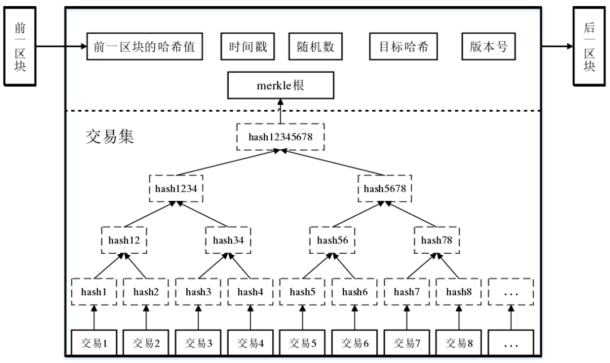

 

## Introduction

 

>   区块链技术的本质是**一种分布式的可靠数据库(账本)，由集体而非单一中心维护**。 
>   将大量交易信息存储在区块内，通过密码算法并按照交易发生的时间顺序将区块依次连接，形成一条数据链，私有区块链是私人加密的，公有区块链中所有接入网络的人都能参与到交易信息的记录、查询和存储。

`#分布式 #共识 #账本`

All nodes run an VM (virtual machine) software as the ***internal layer*** to sync data and transaction,
the **data consistency** was process by the `consensus algorithm` (共识算法)

 
 
 
 
 
 
 

---
##  以太坊是什么?

-   一台世界计算机(EVM)，由全世界的节点组成
-   每个节点上运行了一个 EVM 的客户端实现(类似于geth等等), 就像其他语言的虚拟机一样,  不过主要作用不同
-   EVM 用于在分布全球各地的节点对发出的交易进行 **记账** , 同时基于这种方式获得奖励(**挖矿**), 每个节点都会同步这个账本
- Merkle Tree

---

## The Main Chain

 
 

###  1. BTC

 
Bitcoin于2009年由中本聪（Satoshi Nakamoto）的个人或组织创建，并在其发布的白皮书中描述了其基本原理。

在 Bitcoin 系统中，交易是通过点对点网络进行，每个节点都保存了一个完整的账本，称为区块链。区块链是一个按时间顺序组织的交易记录列表，其中每个区块包含了一组交易记录以及前一个区块的哈希值。通过这种方式，区块链保证了交易的透明性和可靠性。

Bitcoin 系统的货币单位是 BTC（Bitcoin）。BTC 的数量是通过“挖矿”获得的，即通过计算机算力的竞争来生成新的比特币，并验证交易的合法性。比特币的数量是有限的，总量为 21 万枚，预计在 2140 年左右全部生成。

 
 
 
 
 
 
 

---
###  2. ETH

- 以太坊是一个基于区块链技术的开源平台，由Vitalik Buterin在2014年提出。与比特币不同，以太坊的目标是为构建去中心化应用程序（DApp）提供一个**可编程的区块链平台**。
- 它的本质是一个***去中心化的虚拟计算机***，它运行智能合约代码，并使用自己的加密货币 `以太（Ether）` 作为交易费用。
- `ETH` 作为`同步`的gas费

---
 
 

> 以太坊的运作方式类似于比特币，也是由一系列区块组成的链，每个区块包含了若干个交易。以太坊的主要区别在于它不仅支持基本的交易，还支持智能合约。智能合约可以自动执行一系列预定义的规则，实现在区块链上进行各种复杂的业务逻辑。

 
 

 以太坊与比特币的区别还包括：
1.  以太坊具有更快的交易速度和更低的交易费用，可以处理更多的交易量。
2.  以太坊支持智能合约，可以构建各种去中心化应用程序，如去中心化交易所、去中心化游戏等。
3.  以太坊有自己的加密货币以太（Ether），用于支付交易费用和激励矿工。
4.  以太坊采用了不同的共识算法，即工作量证明（Proof of Work）到后来的权益证明（Proof of Stake）。
5.  以太坊支持二层扩展方案，如Plasma和状态通道，可以提高交易吞吐量，降低交易费用。

 
 
 

---
## Numerous Chains

公链、私有链、联盟链、L1和L2是区块链技术中常见的概念，它们之间有以下联系和区别：

1.  公链：公链是一种完全开放的区块链网络，任何人都可以加入并参与其中，如比特币和以太坊等。公链的特点是去中心化、安全性高、交易透明可追溯，但交易速度较慢，成本较高，且难以满足大规模商业应用的需求。

2.  私有链：私有链是一种仅允许特定节点参与的区块链网络，由一些组织或机构控制，如企业内部区块链。私有链的特点是参与者少、交易速度快、成本低、隐私性高，但安全性低，可信度有待考验。
    
3.  联盟链：由多个组织或机构参与构建，授权的节点可以参与验证和确认交易，但不是完全开放的网络。（不赘述)
    
4.  L1：是指区块链的底层协议，如比特币和以太坊等。L1的特点是去中心化、安全性高、可靠性高，但交易速度较慢、扩展性较差。
    
5.  L2：是指建立在L1之上的协议或网络，旨在解决L1的扩展性问题。L2的特点是交易速度快、成本低、可扩展性好，但需要在L1上部署智能合约，可能存在安全风险。
    

---
## Wallet

### 1. 什么是钱包

-   钱包就是卡号和密码
	-  卡号就是地址 `address`
	-  密码就是私钥 `private key`,
	-  address由公钥`public key` 经hash取得, 一个256位数字，表明了你的账户id (唯一的)

 

- 钱包的归属权是由私钥 `private key`决定的，因为私钥是生成地址和签署交易的关键。**Keystore** 文件和助记词 **mnemonic phrase** 都是为了更方便地管理私钥而设计的。
	- `Keystore` 文件是加密的私钥文件，通过输入密码可以解锁私钥；
	- 助记词 `memoric` 是一组单词，通过这组单词可以还原出私钥。

 

- **密钥对**通过算法生成, 在加密货币交易中，发送方使用 `私钥` 对交易进行签名，接收方则使用 发送方的`公钥`  对交易进行验证。  

-   这些**算法**是公开的， 就是说没有注册等等环节， 甚至你在一台不联网的机器上通过对应的函数生成key-pair, 在公链上依然可以导入你的私钥或助记词来正常使用

 
 

---
### 2. Metamask 是什么?

-   `MetaMask` 是一款浏览器插件，用作**钱包**管理与交易进行
-   存储你的私钥、助剂词于本地中
-   `MetaMask` 也是一款ether client，不过他不作节点的`记账`等功能，也就是他没有`挖矿`
-   他只负责在你发送交易请求的时候, 作为client联系你附近的EVM节点。
-   会帮你解决签名nonce，gas等一堆操作

 

 
 

---
## Question?

- ...
 
 
 
 
 
 
 
 
 

---
[→Back](Blogx-Index.md#Content)