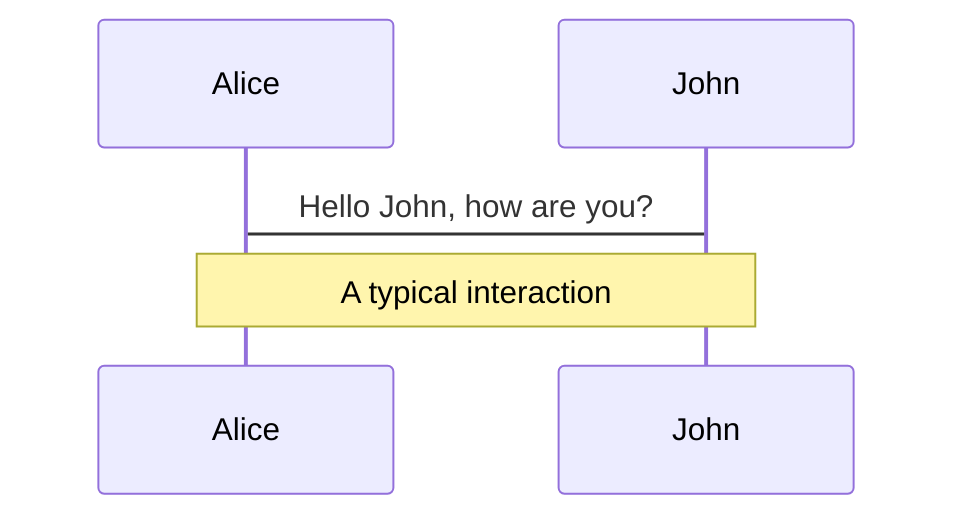
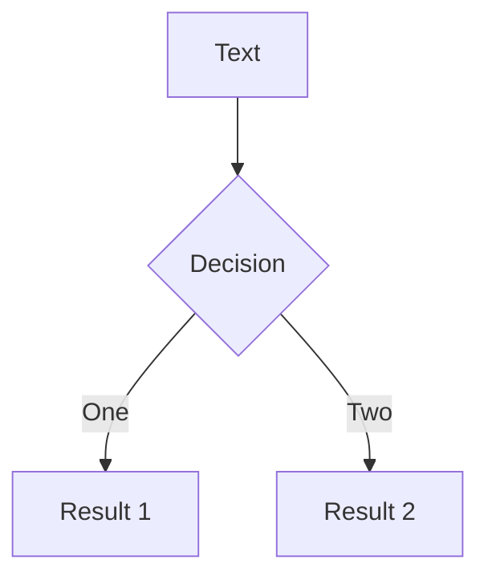

# Block Chain System Generality
@godot42 2023.3.13

<div class="pt-12">
  <span @click="$slidev.nav.next" class="px-2 p-1 rounded cursor-pointer" hover="bg-white bg-opacity-10">
    Press Space for next page <carbon:arrow-right class="inline"/>
  </span>
</div>
---


layout: image-right
background: https://source.unsplash.com/collection/94734566/1920x1080
---

<!-- <style>
h1 {
  background-color: #2B90B6;
  background-image: linear-gradient(45deg, #4EC5D4 10%, #146b8c 20%);
  background-size: 100%;
  -webkit-background-clip: text;
  -moz-background-clip: text;
  -webkit-text-fill-color: transparent;
  -moz-text-fill-color: transparent;
}
</style> -->

# Purpose

1.  Popularize the common-sense about `chain`,  `wallet`  and  `DApp`  
2.  Tear the ***secretive rag*** of block-chain (It's very simple when compared with classic web2.0)
3.  One more hands on `web3` ,  everyone can join the development of things about `contract`, `decentralized`( what we gonna do)
<br>
<br>
---


layout: image-right
image: https://source.unsplash.com/collection/94734546/1920x1080
---
# Content
## 1. The `blockchian` and the `wallet`
<br>

## 2. Smart contract
<br>

## 3. Decentralized storage


---
background: https://source.unsplash.com/collection/94734536/1920x1080
---
# Block Chain
<br>

## Introduction

<br>
<br>

>   区块链技术的本质是**一种分布式的可靠数据库(账本)，由集体而非单一中心维护**。 将大量交易信息存储在区块内，通过密码算法并按照交易发生的时间顺序将区块依次连接，形成一条数据链，私有区块链是私人加密的，公有区块链中所有接入网络的人都能参与到交易信息的记录、查询和存储。

#分布式 #共识 #账本
<br>

All nodes run an VM (virtual machine) software as the ***internal layer*** to sync data and transaction, the **data consistency** was process by the `consensus algorithm` (共识算法)


---
layout: image-right
background: ./attachments/28ddd68a529963ca7ed1d43d1c6a799a.png
---
以太坊是什么?

-   一台世界计算机(EVM)，由全世界的节点组成
-   每个节点上运行了一个 EVM 的客户端实现(类似于geth等等), 就像其他语言的虚拟机一样(JVM, JSVM), 不过主要作用不同
-   EVM 用于在分布全球各地的节点对发出的交易进行 **记账** , 同时基于这种方式获得奖励(**挖矿**), 并将**账本**对所有节点广播，进行同步

- Merkle Tree(右图)
[haha]( ./attachments/28ddd68a529963ca7ed1d43d1c6a799a.png)


---
layout: image-right
image: https://source.unsplash.com/collection/94734536/1920x1080
---


# Code

Use code snippets and get the highlighting directly!

```ts {all|2|1-6|9|all}
interface User {
  id: number
  firstName: string
  lastName: string
  role: string
}

function updateUser(id: number, update: User) {
  const user = getUser(id)
  const newUser = { ...user, ...update }
  saveUser(id, newUser)
}
```

<arrow v-click="3" x1="400" y1="420" x2="230" y2="330" color="#564" width="3" arrowSize="1" />

---

# Components

<div grid="~ cols-2 gap-4">
<div>

You can use Vue components directly inside your slides.

We have provided a few built-in components like `<Tweet/>` and `<Youtube/>` that you can use directly. And adding your custom components is also super easy.

```html
<Counter :count="10" />
```

<!-- ./components/Counter.vue -->
<Counter :count="10" m="t-4" />

Check out [the guides](https://sli.dev/builtin/components.html) for more.

</div>
<div>

```html
<Tweet id="1390115482657726468" />
```

<Tweet id="1390115482657726468" scale="0.65" />

</div>
</div>


---
class: px-20
---

# Themes

Slidev comes with powerful theming support. Themes are able to provide styles, layouts, components, or even configurations for tools. Switching between themes by just **one edit** in your frontmatter:

<div grid="~ cols-2 gap-2" m="-t-2">

```yaml
---
theme: default
---
```

```yaml
---
theme: seriph
---
```


</div>

Read more about [How to use a theme](https://sli.dev/themes/use.html) and
check out the [Awesome Themes Gallery](https://sli.dev/themes/gallery.html).

---
preload: false
---

# Animations

Animations are powered by [@vueuse/motion](https://motion.vueuse.org/).

```html
<div
  v-motion
  :initial="{ x: -80 }"
  :enter="{ x: 0 }">
  Slidev
</div>
```

<div class="w-60 relative mt-6">
  <div class="relative w-40 h-40">
    
    
    
  </div>

  <div
    class="text-5xl absolute top-14 left-40 text-[#2B90B6] -z-1"
    v-motion
    :initial="{ x: -80, opacity: 0}"
    :enter="{ x: 0, opacity: 1, transition: { delay: 2000, duration: 1000 } }">
    Slidev
  </div>
</div>

<!-- vue script setup scripts can be directly used in markdown, and will only affects current page -->
<script setup lang="ts">
const final = {
  x: 0,
  y: 0,
  rotate: 0,
  scale: 1,
  transition: {
    type: 'spring',
    damping: 10,
    stiffness: 20,
    mass: 2
  }
}
</script>

<div
  v-motion
  :initial="{ x:35, y: 40, opacity: 0}"
  :enter="{ y: 0, opacity: 1, transition: { delay: 3500 } }">

[Learn More](https://sli.dev/guide/animations.html#motion)

</div>

---

# LaTeX

LaTeX is supported out-of-box powered by [KaTeX](https://katex.org/).

<br>

Inline $\sqrt{3x-1}+(1+x)^2$

Block
$$
\begin{array}{c}

\nabla \times \vec{\mathbf{B}} -\, \frac1c\, \frac{\partial\vec{\mathbf{E}}}{\partial t} &
= \frac{4\pi}{c}\vec{\mathbf{j}}    \nabla \cdot \vec{\mathbf{E}} & = 4 \pi \rho \\

\nabla \times \vec{\mathbf{E}}\, +\, \frac1c\, \frac{\partial\vec{\mathbf{B}}}{\partial t} & = \vec{\mathbf{0}} \\

\nabla \cdot \vec{\mathbf{B}} & = 0

\end{array}
$$

<br>

[Learn more](https://sli.dev/guide/syntax#latex)

---

# Diagrams

You can create diagrams / graphs from textual descriptions, directly in your Markdown.

<div class="grid grid-cols-2 gap-4 pt-4 -mb-6">





</div>

[Learn More](https://sli.dev/guide/syntax.html#diagrams)


---
layout: center
class: text-center
---

# Learn More

[Documentations](https://sli.dev) / [GitHub Repo](https://github.com/slidevjs/slidev)
