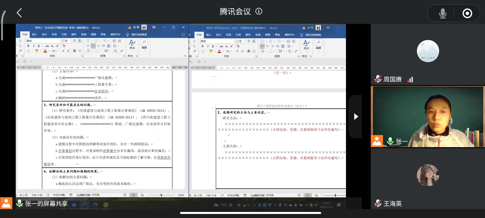

## 任务书 8000-10000 字， 10 ~ 15 页
## 开题报告
- 本科毕业设计开题报告
- 毕业设计（论文）开题报告

1. 第一部分
	1. 选题背景
	2. 国外研究现状
	3. 国内研究现状
	4. 意义( 编完后得到什么，对于同类型(综合单价）的意义)

2. 第二部分 选题研究的方法与主要内容
	1. 研究方法
		1. 对比分析
		2. 案例分析
		3. 调查哦分析
	2. 主要内容
		1. 完成---广联达建模
		2. 完成---工程量手算
		3. 完成---宏业组价
		4. 编制---清单
3. 研究条件和可能存在的问题
 
4. 拟解决的主要问题与预期的结果
	1. 拟解决的主要问题
	2. 预期的结果

## 手算

- 全部
	- 顶层全部
	- 基础全部
	- 底层全部
	- 屋面层全部, 屋面隔热防水
- 部分
	- 标准层(范围以轴线到轴线的构件)(比如一间教室代表一层)
	- 屋顶保温隔热，防水
	- 一层卫生间装修
	- 部分装饰装修

- 平整地面
- 土方
- 广联达 多备份
- 广联达 钢筋设置中线

## 综述 (研究背景)
- 由来
- 评价发展
- 目前问题
- 总结 意义